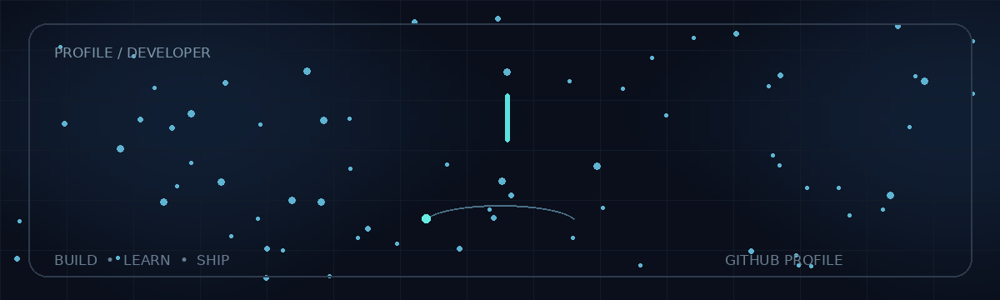

<div align="center">



<br>

<a href="https://github.com/karmapatel">
  
</a>
<a href="https://www.linkedin.com/in/karma-patel-212277375/">
  
</a>
<a href="https://github.com/karmapatel?tab=repositories">
  
</a>

</div>

<br>

## About

I'm a Computer Science student interested in **backend engineering, cloud infrastructure, and practical AI integration**.

I enjoy turning ideas into working software and learning the engineering behind the systems I build.

```text
Currently building      → Backend projects & APIs
Currently learning      → DSA • Docker • Cloud • AI integrations
Core tools              → Python • Flask • SQL • C/C++
```

---

## Contribution Activity

<div align="center">


</div>

---

## Tech Stack

<div align="center">


</div>

---

## Selected Projects

### TaskFlow

Project and task management platform built with Flask, SQLAlchemy and Supabase.

**Stack:** Python · Flask · SQLAlchemy · PostgreSQL · Jinja2

### DropShare

Temporary file-sharing application using short codes, expiration windows and direct file downloads.

**Stack:** Python · Flask · Supabase · PostgreSQL

### RahatSetu (SIH)

Disaster-management platform focused on reporting societal problems and matching them with potential solutions and collaborators.

**Stack:** TypeScript · Backend APIs · AI integration · Database systems

---

## GitHub Stats

<div align="center">


<br><br>


</div>

---

<div align="center">

### Let's build something useful.

<a href="https://github.com/karmapatel">GitHub</a>
  ·   <a href="https://www.linkedin.com/in/karma-patel-212277375/">LinkedIn</a>

<br><br>


</div>
